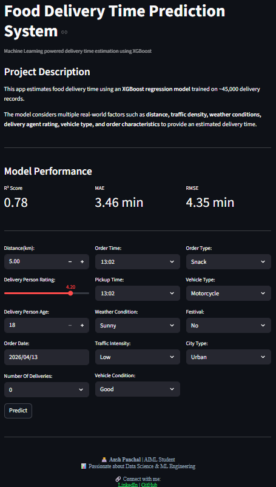
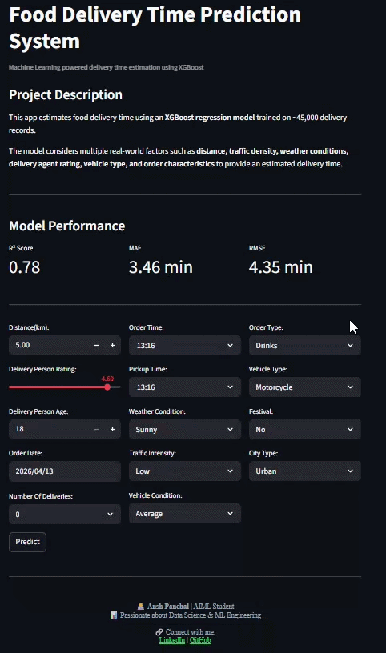

# 🍔 Food Delivery Time Prediction System  


🚀 A **Machine Learning-powered web application** that predicts food delivery time based on real-world logistics data such as distance, traffic, weather, and operational conditions.

---

## 🎯 Why This Project Matters

Accurate delivery time prediction is critical for:
- 🍔 Food delivery platforms (Swiggy, Zomato)
- 📦 Logistics & supply chain optimization  
- 🚚 Last-mile delivery systems  

This project simulates a **real-world ML production use case**, focusing on both:
- 📊 Model performance  
- 💻 User-facing application  

---

## 🧠 Model Overview

- **Algorithm:** XGBoost Regressor  
- **Dataset Size:** ~45,000 records  
- **Pipeline:** Custom Feature Engineering + Encoding + Model  

### 📊 Performance

| Metric | Value |
|--------|------|
| R² Score | **0.78** |
| MAE | **3.46 minutes** |
| RMSE | **4.35 minutes** |

---

## ⚙️ Key Features

✅ Real-time delivery time prediction  
✅ Interactive Streamlit UI  
✅ Feature engineering pipeline (time-based + categorical handling)  
✅ Business-relevant inputs (traffic, weather, distance, etc.)  
✅ Fast inference using pre-trained model  

---

## 🧩 Feature Engineering Highlights

- ⏰ Extracted **order hour, pickup hour, weekday**
- 🚦 Encoded **traffic intensity**
- 🚗 Mapped **vehicle types & conditions**
- 📊 Handled real-world categorical data  

---

## 💻 Tech Stack

| Category | Tools |
|--------|------|
| Language | Python |
| ML | XGBoost, Scikit-learn |
| Data | Pandas, NumPy |
| Frontend | Streamlit |
| Deployment | Streamlit Cloud (optional) |

---

## 📸 App Preview

### 🖥️ UI
<p align="center">
  
</p>

### 🎥 Demo Video
<p align="center">
  
</p>

---

## 🚀 Live Demo 

🔗 https://food-delivery-time-prediction-0.streamlit.app

---

## 📦 Installation & Setup

### 1️⃣ Clone the repository
```bash
git clone https://github.com/4nshhh/Food-Delivery-Time-Prediction.git
cd Food-Delivery-Time-Prediction
```
### 2️⃣ Install dependencies
```bash
pip install -r requirements.txt
```
### 3️⃣ Run the app
```bash
streamlit run app.py
```

## 📁 Project Structure
```bash
food-delivery-time-prediction-system/
├── app.py
├── delivery_time_pipeline.pkl
├── requirements.txt
├── README.md
├── screenshot.png
└── demo.gif
```

---

## 🔮 Future Improvements

- 📊 Add EDA dashboard  
- 🤖 Try advanced models (LightGBM, Neural Networks)  
- 🌍 Deploy with Docker / AWS  
- 📱 Improve UI/UX (animations, responsiveness)  
- 📈 Add prediction confidence intervals  

---

## 👨‍💻 Author

**Ansh Panchal**  
🎓 AIML Student | L.D College of Engineering  
📊 Interested in Data Science & ML Engineering  

🔗 [LinkedIn](https://www.linkedin.com/in/4nshh/)  
💻 [GitHub](https://github.com/4nshh)  

---

## ⭐ If you like this project

Give it a ⭐ and feel free to fork or contribute!


